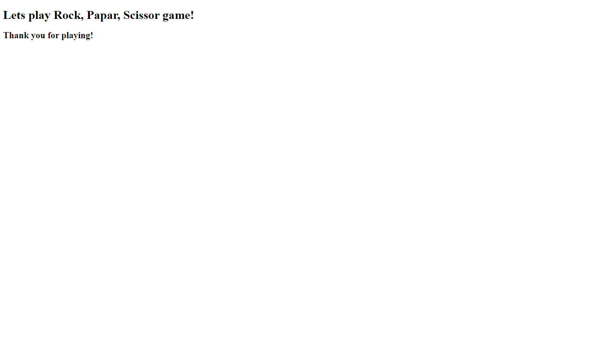

# Rock-Paper-Scissors-Game-
In this project I am building a Rock, Paper, Scissor game using only JavaScript.

## Instructions

The completed application should meet the following criteria:

* As a user, I want to play Rock, Paper, Scissors against an automated opponent.

* As a user, I can enter R, P, or S to signify my choice of rock, paper, or scissors.

* As a user, I expect the computer to choose R, P, or S in return.

* As a user, I want the option to play again whether I win or lose.

* As a user, I want to see my total wins, ties, and losses after each round.

### Specifications

* Must use the `alert()`, `confirm()`, and `prompt()` methods to collect user input and display information to the user.

* The computer's selection must be random to ensure a fair game.

## Link To Deployed Webpage

https://eugeneisingizwe.github.io/Rock-Paper-Scissors-Game/

## Screen Shot

